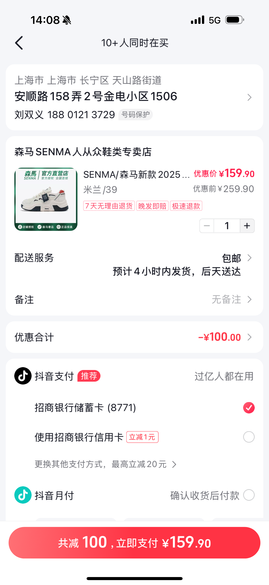
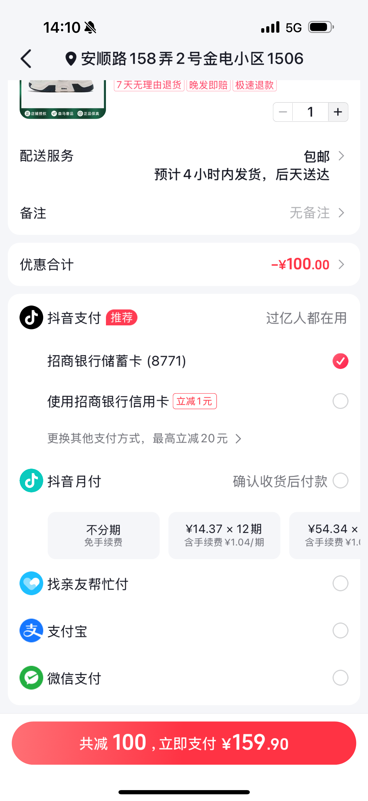
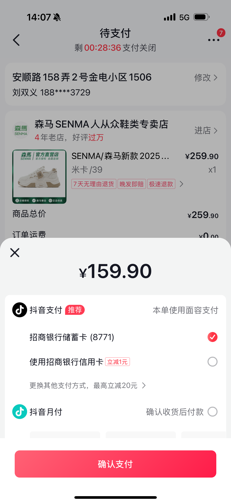
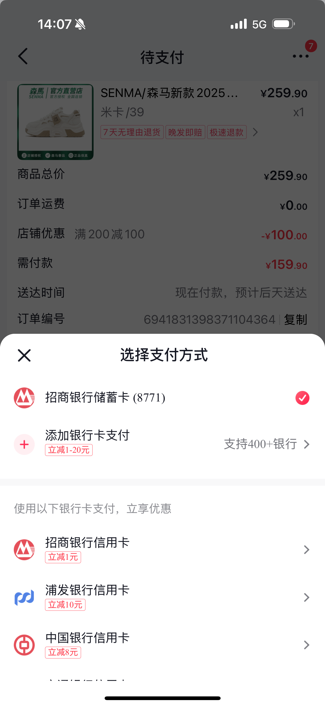
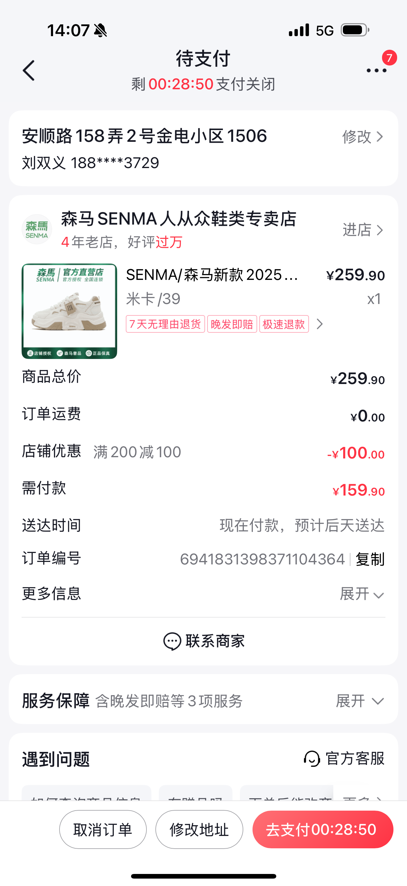

# 刘双义的项目

## 2022.5 - 至今

### 抖音电商提单页

1. **提单页的重构和页面优化**

    
    

2. **提单页的性能优化**

安卓效果：

<video width="320" height="240" controls>
  <source src="./images/andriod-performance.mp4" type="video/mp4">
</video>

iOS效果：

<video width="320" height="240" controls>
  <source src="./images/ios-perfermance.mp4" type="video/mp4">
</video>

3. **继续支付页 - 财经模块**

    
    

4. **订单详情**

    

5. **三端一致性检测平台**

Demo：

<video width="320" height="240" controls>
  <source src="./images/ui-diff.mp4" type="video/mp4">
</video>